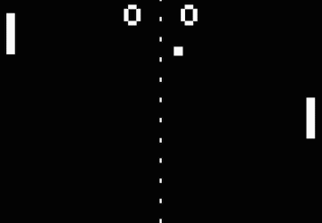

# Fast-Pong

## Controls 

up arrow = paddle goes up 
 
down arrow = paddle goes down 
 
## Realisation 

I used a framework from a youtuber called ChiliTomatoNoodle (https://www.youtube.com/user/ChiliTomatoNoodle) which regulates the programs window,
and the communication with the OS(graphics, input...). 
The AI works based on the ball. If the ball moves down bellow the middle of the AI paddle ( up or down) the AI follows slowly, if it goes beyond the edge of AI's paddle it moves quickly (up or down).
Point is scored if the ball hits the edge of the screen.
All the graphics have been made with the "PutPixel" function so everything is drawn pixel by pixel.

## More info 

The left player is an AI. You play as the right side.

Score goes up to highest 10, whoever reaches it first wins.

For each point press enter to start the new point (serve the ball).

The screen displays W for win and L for lose at the end.

Press enter to start another match.
